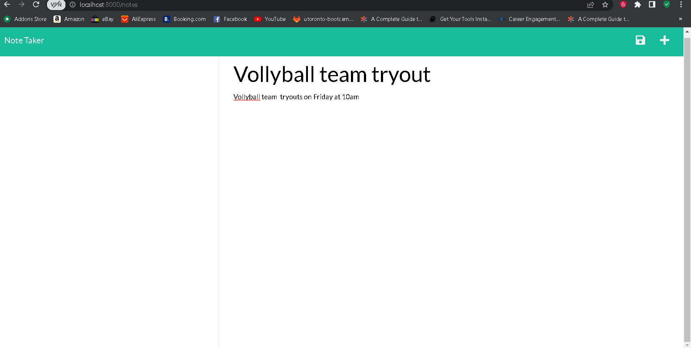

# note-taker

Description

Provide a short description explaining the what, why, and how of your project. Use the following questions as a guide:

- What was your motivation?
To build an appilication to write and save notes using express.js and connecting two files together

- Why did you build this project?
building ths project provides the way of note taking and adding the notes to saved data where and whenever you go

- What problem does it solve?
using express.js i was able to work in the backend and connect the two files together which give you the option to take notes and later save them

- What did you learn?
i learned the different methods of express and javascript backend i order to route and connect the files togther from the backend

## Table of Contents (Optional)


- [Installation](#installation)
- [Usage](#usage)
- [Credits](#credits)
- [License](#license)

## Installation
For this installation you will need to install expree.js 


## Usage

Provide instructions and examples for use. Include screenshots as needed.



    ```

## Credits

List your collaborators, if any, with links to their GitHub profiles.

If you used any third-party assets that require attribution, list the creators with links to their primary web presence in this section.

If you followed tutorials, include links to those here as well.

## License


MIT License

Copyright (c) [2023] [Abel]

Permission is hereby granted, free of charge, to any person obtaining a copy
of this software and associated documentation files (the "Software"), to deal
in the Software without restriction, including without limitation the rights
to use, copy, modify, merge, publish, distribute, sublicense, and/or sell
copies of the Software, and to permit persons to whom the Software is
furnished to do so, subject to the following conditions:

The above copyright notice and this permission notice shall be included in all
copies or substantial portions of the Software.

THE SOFTWARE IS PROVIDED "AS IS", WITHOUT WARRANTY OF ANY KIND, EXPRESS OR
IMPLIED, INCLUDING BUT NOT LIMITED TO THE WARRANTIES OF MERCHANTABILITY,
FITNESS FOR A PARTICULAR PURPOSE AND NONINFRINGEMENT. IN NO EVENT SHALL THE
AUTHORS OR COPYRIGHT HOLDERS BE LIABLE FOR ANY CLAIM, DAMAGES OR OTHER
LIABILITY, WHETHER IN AN ACTION OF CONTRACT, TORT OR OTHERWISE, ARISING FROM,
OUT OF OR IN CONNECTION WITH THE SOFTWARE OR THE USE OR OTHER DEALINGS IN THE
SOFTWARE.
